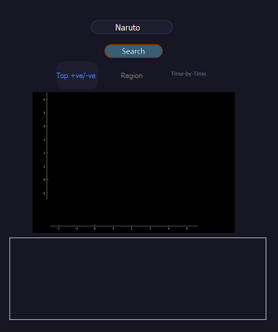
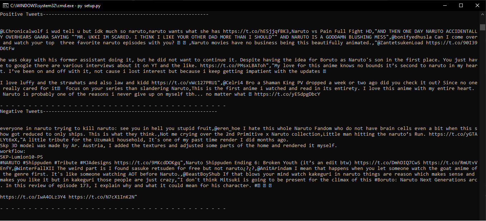

<div align="center"><H1> Tic-Tech-Toe'20 </H1>
<H2> Team weebDevs presents you the <I>SentiBot </I>  </H2></div> 


### *Description*: :newspaper:


Senti bot is a python and pyqt5 based GUI application which helps a user to analyse the sentiments for a particular keyword entered. The user can either analyse the latest tweets updated and can also set the region (beta) for analysing.

---

### *Problem it solves*: 

Nowadays we see hate factors growing among people using social media, to curb that if you want your content to be filtered as per your choice, the SentiBot
helps you. Even we can have a look at what other people think about a particular product which you are planning to consume. For eg : If you want to be a customer of any edtech company, you can have a look at the opinions others are having about the product. Also if you want to sell your product you can get to know the scope of your product according to region. 

---

### *Prerequisites*:
- ```Python 3.x ```

### *APIs used*:
- ```Tweepy```
- ```GeoPy```

### *Other tools used*: 
- ```Python-CSV```
- ```JSON```
- ```TextBlob```
- ```PyQt5, PyQtGraph```
- ```Matplotlib```

---

### *Challenges we faced*: :muscle:

#### UI team:
  - Due to lack of knowledge it was tough when it came to minute changes.
  - Couldn't make a move when we had a change of plans eg., Textbox for printing the positive and negative tweets.
  - Both back end and front end were completly seperate (ie., No communication) therefore had a tough time thinking out what the backend team was doing.
  - When making the main window we had no clue how the program is being made.
#### Backend team:
  - We tried to scrape and fetch data from Twitter using APIs , for which we had  to learn efficient methods to scrape the data as well as link with the GUI, for which intially we had some issues during the coding phase.
  - Since our team is new to this *hackathon* concept, the UI team had to face some problems during the course of developing.

---

### *User Interface*:

1. User should enter the keyword ';' location to get tweets particular to keyword and the tweets in and around the location entered (Beta).
2. So the user will get the sentimental analysis and the graph related to the positive and negative measurements.
3. Also user will get the top 10 positive and negative tweets in the terminal (which in the future we will turn it on for the GUI app itself).

#### Here are a few screenshots of the GUI:

##### The UI :computer:


#### When Top tweets is selected





#### When time by time analysis is selected


> Note: +1 indicates most positive tweet and -1 indicates most negative tweet

---

### *Installation Guide*: :wrench:

#### For Linux/Windows:

1. Download Python
  * For Windows: check this [link](https://www.python.org/downloads/)
  * For Linux: 
  
   ``` 
    sudo apt-get update
    sudo apt-get install python3.8 python3-pip      
   ```
> In case you don't have git installed, you can download from [here](https://git-scm.com/downloads)

> Run the following commands in __git bash__ or __cmd__ if you're on Windows. And Terminal if you're on Linux.

2. Clone the repo:

```git clone https://github.com/insaiyancvk/SentiBot ```

3. Change into the directory:

```cd Sentibot```

4. Install all the dependencies:

```pip install -r requirements.txt```

5. Run the setup file:
 
```python3 setup.py``` 

> please note that the graph will be shown in a new window, and the top tweets will be printed on the terminal

---

### Contribution

Feel free to make issues and send PRs

---

### The team split:
##### Back end:
[@insaiyancvk](https://github.com/insaiyancvk) [@RudCodera8](https://github.com/RudCodera8)
#### Front end:
[@vyshnavp6423355](https://github.com/vyshnavp6423355) [@Arty-001](https://github.com/Arty-001) [@DeadlyBlessing](https://github.com/DeadlyBlessing)
